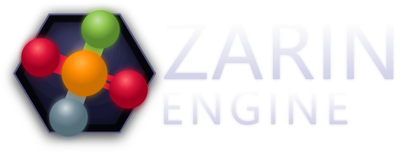

# ZarinHub

Version manager and launcher for ZarinEngine.

## What's the point

ZarinEngine lives on GitHub. Downloading a release archive manually every time, extracting it, setting up the environment — it gets old fast. ZarinHub does the boring parts: fetches the right version, creates a virtualenv, installs dependencies.

Also keeps your projects in one place instead of scattered across the disk.

## Features

- **Install versions** — grab the latest release, any specific tag, or a fresh build from master.
- **Side-by-side versions** — installed versions don't interfere, switching between them is straightforward.
- **Projects** — create, open, delete. Each project remembers which engine version it was made for.
- **Launch** — fire up the editor or player with one click, optionally passing a .zpes file.
- **Auto Python install** — if Python 3.13 isn't found, ZarinHub can download and install it.
- **C++ Build Tools** — optional, needed for pybullet and other native extensions.
- **File association** — .zpes files get registered. Double-click opens the scene in the editor.

## Installation

### Prebuilt binary

Grab the installer from the [releases page](../../releases). It's an Inno Setup installer — picks a directory, writes registry entries, done.

### From source

```bash
git clone https://github.com/EgorKonstrukt/ZarinHub.git
cd ZarinHub
pip install -r requirements.txt
python main.py
```

Minimal dependencies — PyQt6 and requests.

## First run

First launch shows an empty project list and an empty install list. Here's what to do:

1. Switch to the **Installs** tab.
2. Click **Check for updates** — available versions from GitHub show up.
3. Pick one and click **Download**.

ZarinHub takes it from there: downloads the archive, unpacks it, creates a venv, installs requirements. The install dialog shows everything as it happens.

Once a version is installed, you can create projects and launch the editor.

## File layout

```
~/.zarinhub/
├── config.json              # hub settings
├── installed_versions.json  # list of installed engine versions
├── projects.json            # project list
├── Editors/                 # installed engine versions
│   └── v1.0.0/
│       ├── main.py
│       ├── .venv/           # virtualenv for this version
│       └── ...
└── Projects/                # projects (configurable path)
    └── MyGame/
        ├── ProjectSettings.json
        ├── assets/
        └── scenes/
```

## How it works

ZarinHub talks to the GitHub API (using urllib, not requests — one less dependency to bundle), fetches the release list or branch info, downloads a zip, extracts to a temp folder, moves it to `Editors/<tag>`, creates a venv, and runs `pip install -r requirements.txt`.

The editor is launched via `subprocess` — either `python main.py` directly, or a precompiled `main.exe` if one exists.

Projects are stored as JSON — a flat list with paths, names, and associated engine versions.

## Building the installer

```bash
python build_nuitka.py
```

Builds a one-dir package with Nuitka. If Inno Setup is available, it also generates an installer.exe.

## License

ZarinHub is part of the ZarinEngine ecosystem. Same MIT license as the engine.
